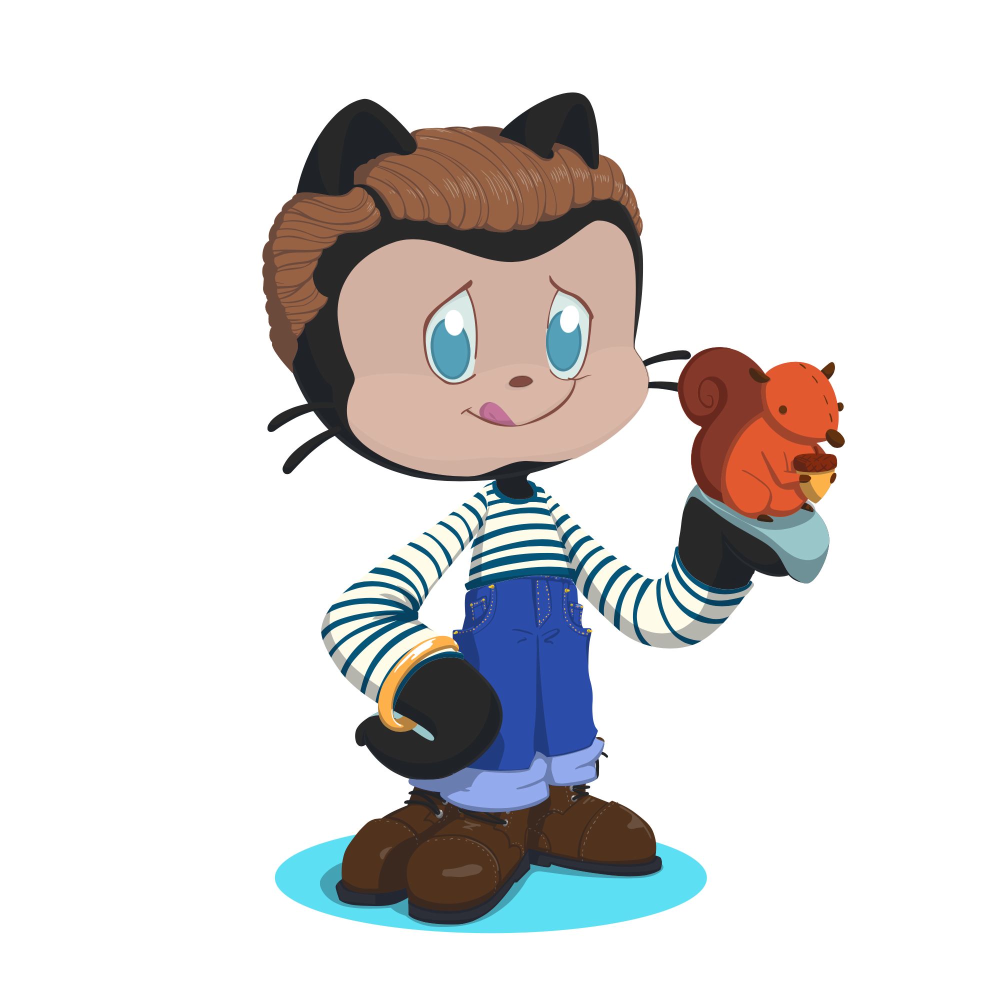
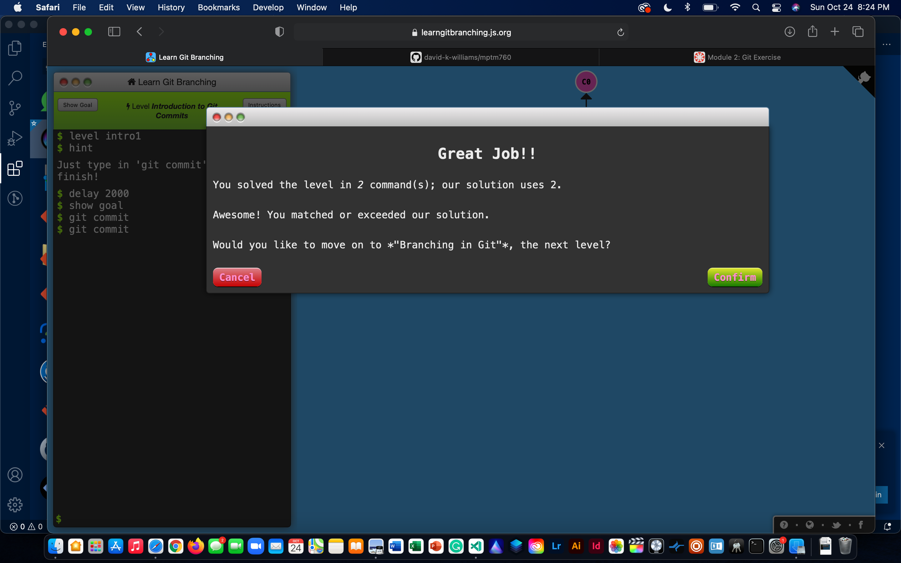
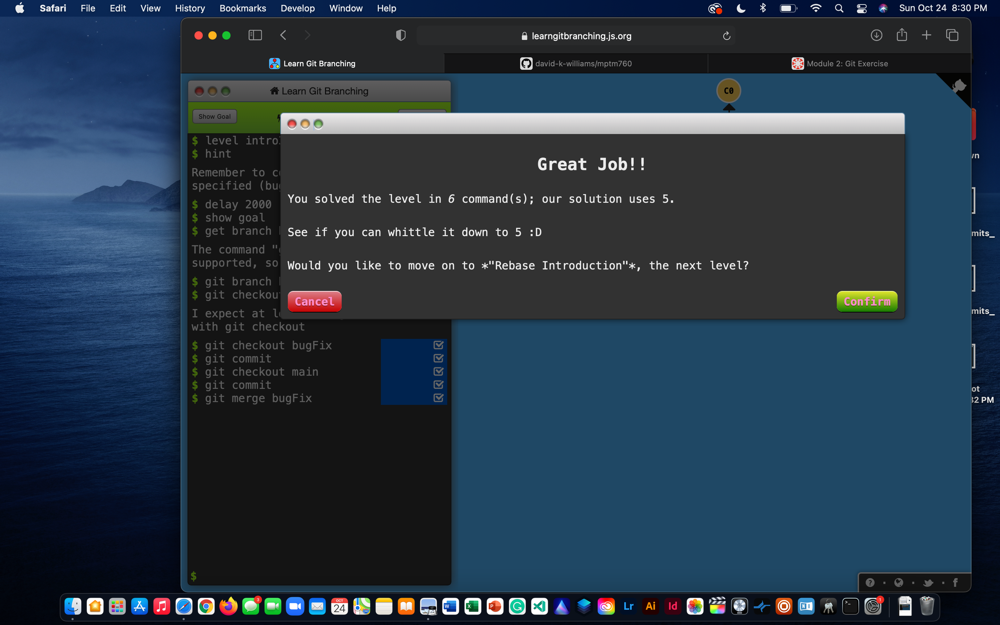
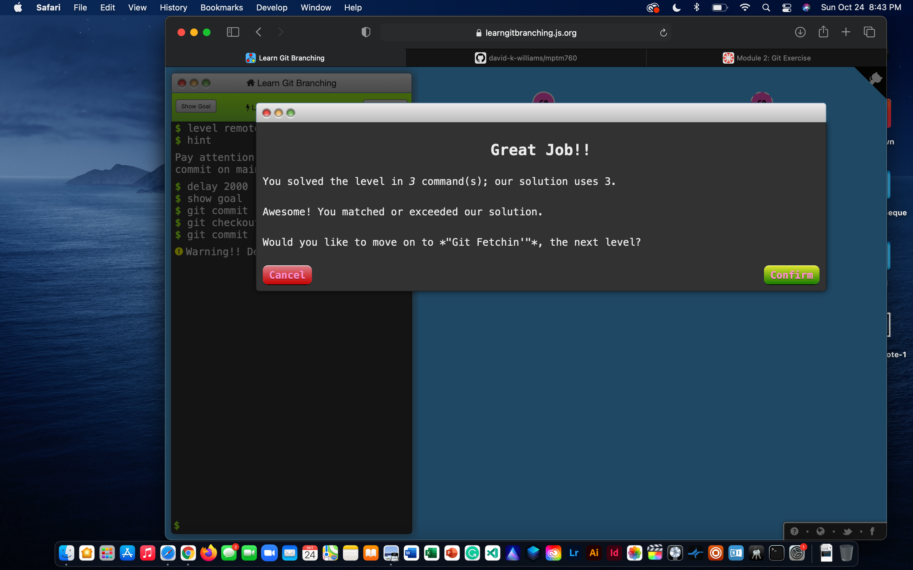
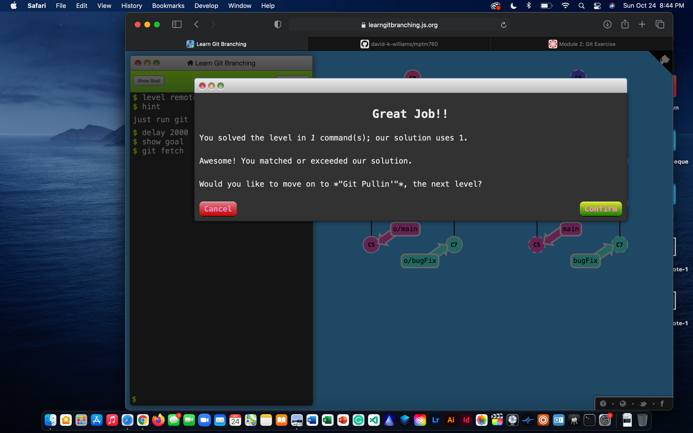
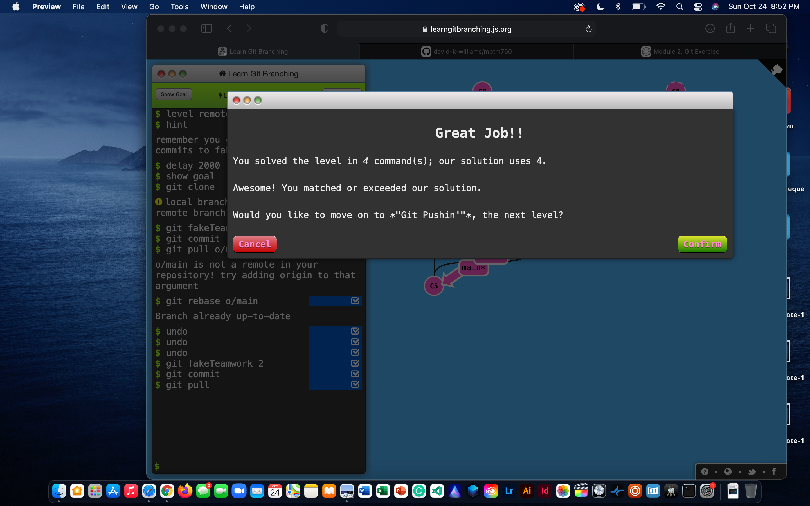

# mptm760 - david williams

## Module 2 - Activity

### Git Commits
#### Intro 1.1

#### Intro 1.2

#### Intro 1.3

#### Intro 1.4

### Git Remote - Push & Pull

#### Git Remote - Push & Pull 1.1

#### Git Remote - Push & Pull 1.2

#### Git Remote - Push & Pull 1.3

#### Git Remote - Push & Pull 1.4

#### Git Remote - Push & Pull 1.5

#### Git Remote - Push & Pull 1.6

#### Git Remote - Push & Pull 1.7

